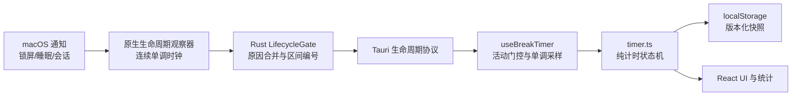
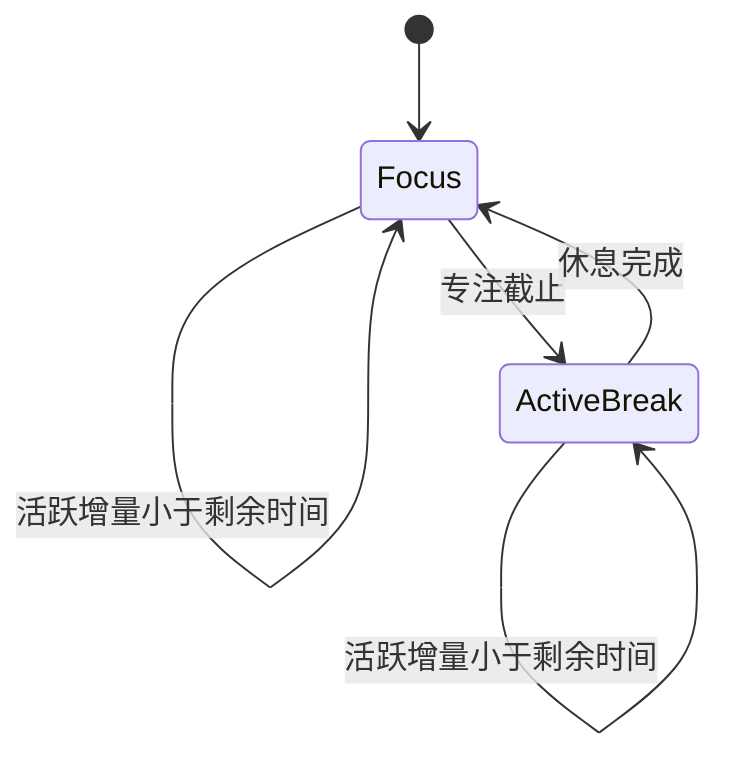

# 锁屏、睡眠与应用退出期间的计时语义设计

| 文档状态 | 日期 | 说明 |
|---|---|---|
| 已实现 | 2026-09-07 | 对应 [User Story](2026-09-07-lifecycle-timer-user-story.md) |

## 1. 目标

1. 只有 Outsie 正在运行、会话活跃且计时未暂停时才累计专注。
2. 锁屏、显示器休眠、系统睡眠和用户会话离开形成可信的不活动区间。
3. 进程内活动时间与不活动时间均不依赖可调整的系统墙钟计算时长。
4. 主动休息和被动休息使用明确、互斥的记账规则。
5. 所有生命周期区间与休息完成操作可安全重放，不重复记账。
6. 保留现有设置、统计、历史、延迟休息和自动开始行为。

## 2. 非目标

- 不同步扩展仓库中的 Electron 历史基线。
- 不实现跨进程关闭时长推断或云端同步。
- 不把普通键鼠空闲视为停止工作。
- 不加入手机靠近自动解锁、蓝牙或身份认证能力。

## 3. 现状与问题

当前 `src/lib/timer.ts` 使用 `Date.now() - updatedAt` 推进状态，并用五分钟阈值判断是否恢复。该启发式无法区分短锁屏、短睡眠、短暂退出和系统时钟跳变。

Tauri 原生层已有强制休息截止时间和键鼠闲置监控，但没有将 macOS 生命周期传递给共享计时核心。Electron 基线虽监听锁屏、解锁和唤醒事件，但事件只用于 Kiosk 与安全锁屏控制。

## 4. 统一术语

| 业务术语 | 技术术语 | 定义 |
|---|---|---|
| 活跃时间 | active elapsed | Outsie 进程运行、macOS 会话活跃且未被生命周期门控的单调时间增量 |
| 不活动区间 | inactivity interval | 锁屏、睡眠或用户会话离开原因集合从空变为非空，直到重新变空的时间并集 |
| 被动休息 | passive rest | 专注期间发生的不活动区间 |
| 主动休息 | active break | 已经进入 `short` 或 `long` 阶段的休息倒计时 |
| 应有休息 | due break | 按现有周期规则下一次应完成的休息；已有延迟休息时指该原休息 |
| 休息身份 | break ID | 一次主动或延迟休息从创建到完成/跳过保持不变的唯一标识 |
| 区间身份 | interval ID | 一个原生不活动区间的进程内唯一标识，用于幂等消费 |
| 墙钟 | wall clock | 仅用于本地日期和完成时间展示的 `Date.now()` 时间 |

## 5. ADR：计时权威边界

### Context

共享 TypeScript 状态机已经承载设置、统计、历史、短休息/长休息节奏与延迟规则。macOS 原生层最可靠地知道锁屏和睡眠边界，但系统墙钟可被用户或时间同步服务调整。

### Options

1. 保留墙钟推进，在生命周期事件到来时修正 `updatedAt`。
2. TypeScript 保留业务状态机，原生层提供可信生命周期区间，所有推进使用单调增量。
3. 将完整计时状态机、统计和持久化迁移到 Rust。

### Trade-off

| 方案 | 优点 | 缺点 |
|---|---|---|
| 墙钟修正 | 改动最少 | 仍受时钟跳变、事件丢失、重叠生命周期和恢复竞态影响 |
| 混合状态机 | 业务规则保持单一来源；原生边界可靠；纯函数易测试 | 需要定义生命周期协议并重构 hook 的推进方式 |
| 全量 Rust | renderer 停滞时仍可维护完整状态 | 重写范围大；双语言迁移和存储兼容风险高 |

### Decision

选择方案 2：**原生生命周期门控 + TypeScript 纯状态机 + 单调增量推进**。

### Consequences

- `timer.ts` 不再从两个墙钟时间推导经过秒数。
- React hook 成为进程内单调时钟驱动器。
- Tauri 原生层只拥有生命周期事实与强制休息 UI，不拥有统计业务规则。
- 需要为事件重放和旧存储增加兼容逻辑。

## 6. 组件与依赖方向



依赖只指向共享计时核心：核心不知道 Tauri、macOS、React 或存储实现。

### 6.1 `src/lib/timer.ts`

负责：

- 以显式 elapsed 秒数推进专注或主动休息。
- 应用一次不活动区间并执行被动休息规则。
- 根据现有节奏确定应有休息类型与阈值。
- 按 `breakId` 和 `intervalId` 保证幂等。
- 迁移并验证持久化状态。

不负责：

- 读取 `Date.now()` 差值。
- 监听系统事件。
- 判断应用是否运行。

### 6.2 `src/hooks/useBreakTimer.ts`

负责：

- 用 `performance.now()` 采样进程内活动增量。
- 收到 `inactive-start` 时停止活动推进并立即保存快照。
- 收到 `inactive-end` 时应用原生区间，重置活动基线并确认区间。
- 页面退出前只刷新已知活动增量，不回放页面关闭后的时间。

### 6.3 `src/tauriBridge.ts`

新增独立 `onLifecycle` 订阅和状态同步方法。生命周期消息与托盘命令分离，避免把系统事实混入用户命令。

### 6.4 `src-tauri/native/macos.m`

观察：

- `com.apple.screenIsLocked` / `com.apple.screenIsUnlocked`。
- `NSWorkspaceWillSleepNotification` / `NSWorkspaceDidWakeNotification`。
- `NSWorkspaceScreensDidSleepNotification` / `NSWorkspaceScreensDidWakeNotification`。
- 用户会话离开/恢复通知作为会话切换覆盖。

原生时长使用 `mach_continuous_time`，该时钟在系统睡眠期间仍递增。

### 6.5 `src-tauri/src/lib.rs`

新增平台无关 `LifecycleGate`：

- 使用原因集合处理锁屏与睡眠重叠。
- 只在集合 `0 → 1` 时开始区间，在 `1 → 0` 时结束区间。
- 将解锁和会话恢复视为权威恢复信号，清除缺失结束通知留下的原因，避免永久门控。
- 生成唯一 `intervalId`。
- 有界保留最多 32 个未确认完成区间，允许 renderer 初始化或刷新后重放。
- 强制休息完成事件携带 `breakId`，并使用连续单调截止时间。

## 7. 生命周期协议

```ts
type InactivityReason = 'screen-lock' | 'display-sleep' | 'system-sleep' | 'session-inactive'

type LifecycleEvent =
  | { type: 'inactive-start'; intervalId: string; sequence: number; reason: InactivityReason; startedAt: number }
  | {
      type: 'inactive-end'
      intervalId: string
      sequence: number
      elapsedSeconds: number
      startedAt: number
      endedAt: number
    }
```

原生层还提供当前快照与确认命令：

- 初始化订阅后读取当前活跃/不活跃状态，弥补监听器注册前的事件窗口。
- `inactive-end` 在收到前端确认前可以重放；事件按原生单调 `sequence` 排序，不使用墙钟排序。
- TypeScript 状态有界保存最近 32 个 `lifecycleIntervalIds`；重复或较早重放的区间直接忽略后仍发送确认。

墙钟字段只用于统计日期归属。`elapsedSeconds` 是唯一可增加统计或减少倒计时的数值来源。

## 8. 状态转换规则

### 8.1 活跃推进



一次推进最多跨越当前阶段的截止点。若阶段转换发生，剩余增量不继续回放到新阶段，保持现有“不回放未展示休息”的原则。

### 8.2 专注期间的不活动区间

前提：开始区间时 `phase === 'focus' && running === true`。

1. 确定应有休息：有 `deferredBreak` 时使用它，否则沿用现有短/长休息节奏。
2. 专注剩余时间保持不变。
3. `breakSeconds += elapsedSeconds`。
4. 若未达到应有休息完整时长，只保存统计。
5. 若达到阈值：
   - `completedBreaks += 1`；
   - 写入一次对应类型历史；
   - 短休息推进周期，长休息重置周期；
   - 清除已有延迟休息身份；
   - 设置完整的新专注周期；
   - `running` 遵循 `autoStart`。

### 8.3 主动休息期间的不活动区间

前提：开始区间时处于未暂停的 `short` 或 `long`。

1. 最多推进当前主动休息的剩余时间。
2. 不足截止时间时，返回后继续剩余休息。
3. 达到截止时间时，按原 `breakId` 完成一次并进入完整新专注。
4. 超出当前休息截止点的离开时间不推进新专注，也不触发下一次被动休息完成。

### 8.4 暂停与退出

- 手动暂停时，活动增量和不活动区间都不增加统计或自动完成休息。
- 页面退出前保存最后一个已知活动增量。
- 重新启动只恢复快照，将新的单调基线设为启动时刻。
- 未闭合的不活动区间随进程退出丢弃，绝不跨进程推断。

## 9. 持久化兼容

状态版本升级为 v2，但继续读取现有存储键，避免用户数据丢失。

新增字段：

- `lifecycleIntervalIds: string[]`，最多保留最近 32 个已消费区间。

迁移规则：

- v1 设置、统计、历史和当前阶段全部保留。
- v1 恢复时 `lifecycleIntervalIds = []`；早期 v2 的单个 `lastLifecycleIntervalId` 自动迁移到列表。
- 恢复时不再根据 `updatedAt` 补算任何时间。
- `updatedAt` 保留为最后保存/展示墙钟，不参与 elapsed 计算。
- 非法 ID、负数和非有限 elapsed 在系统边界拒绝；合法的长时间睡眠不设人为上限。

## 10. 并发与幂等

| 风险 | 防护 |
|---|---|
| 锁屏后又睡眠 | 原因集合合并为一个区间 |
| 重复锁屏/唤醒通知 | 集合操作幂等；无 `0 ↔ 1` 转换则不发新区间 |
| renderer 初始化错过事件 | 启动快照 + 未确认完成区间重放 |
| 快照与实时事件交错 | 原生单调序号排序；同一类型与区间 ID 去重 |
| 完成区间重复或乱序投递 | 最近 32 个 `lifecycleIntervalIds` 去重，与原生待确认队列上限一致 |
| 原生完成与生命周期结束竞态 | 两者都携带 `breakId`；状态机只接受当前身份 |
| 旧休息完成事件晚到 | `breakId` 不匹配则忽略 |
| 系统墙钟跳变 | elapsed 只来自单调时钟 |

## 11. 错误处理与降级

- macOS 生命周期快照读取失败时，不再用墙钟缺口猜测；已注册的实时事件与活动 tick 仍工作。
- 非法生命周期 payload 在 Tauri 边界拒绝，不修改计时状态。
- `localStorage` 写入失败沿用现有降级：当前进程继续计时，但重启可能无法恢复。
- 生命周期区间确认失败时保留区间，下一次同步可重放；状态机去重保证安全。
- 原生强制休息窗口创建失败不改变核心休息完成规则。

## 12. 可观测性

本地桌面应用不新增网络遥测。生命周期快照、区间 ID、原生单调序号和确认结果只在进程内用于可靠投递；不记录用户输入、窗口内容或身份信息。

## 13. 测试策略

### TypeScript 状态机

- 活跃单调增量与墙钟前跳/后退。
- 启动恢复不补算关闭时间。
- 被动休息小于、等于、大于短休息阈值。
- 长休息节奏、自动开始关闭、跨午夜统计。
- 延迟休息不足/足量、同一 `breakId`、无第二次延迟机会。
- 主动休息在后台未完成/刚好完成/超时完成。
- 重复区间、重复原生完成和过期完成事件。
- 手动暂停不自动记账。

### Rust 生命周期门控

- 单个锁屏区间。
- 锁屏与睡眠重叠。
- 重复和乱序开始/结束通知。
- 未确认区间重放与确认。
- 连续单调截止时间完成主动休息。

### macOS 验证

- 短锁屏、足量锁屏、睡眠、锁屏后睡眠。
- 主动短休息/长休息中锁屏或睡眠。
- 解锁状态退出并重开。
- 手动修改系统时间前后，累计秒数不跳变。

## 14. 实现结果

- TypeScript 状态机使用显式 elapsed API，恢复快照时不补算关闭期间时间。
- React 驱动器用 `performance.now()` 推进活动时间，并在生命周期开始/结束边界立即持久化与重置采样基线。
- Rust 将锁屏、睡眠和会话离开合并为同一不活动区间；区间由 `mach_continuous_time` 计量，并以进程内单调序号重放。
- 显示器休眠单独纳入原因集合；解锁或会话恢复可收敛残留原因并保证活动计时恢复。
- 主动严格休息也使用连续时钟截止时间；原生完成事件携带 `breakId`，与生命周期区间的 `intervalId` 分别去重。
- Electron 仅作为历史行为参考，未同步修改；手机接近、自动解锁及身份认证仍明确不在范围内。

## 15. 参考资料

- [Apple NSWorkspace 生命周期通知](https://developer.apple.com/documentation/appkit/nsworkspace)
- [Apple mach_continuous_time](https://developer.apple.com/documentation/driverkit/mach_continuous_time)
- [Electron macOS 锁屏事件实现](https://github.com/electron/electron/blob/main/shell/browser/api/electron_api_power_monitor_mac.mm)
- [Tauri Rust 到前端事件](https://v2.tauri.app/develop/calling-frontend/)
