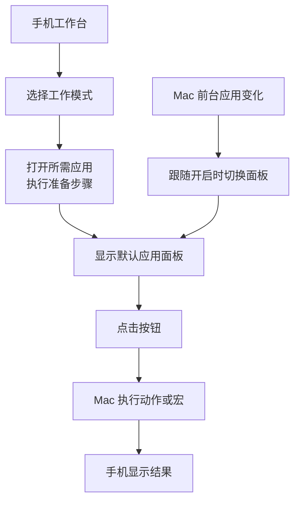

# Repose 手机工作台：产品定义 v0.1

日期：2026-09-08。状态：历史讨论方案。用户已确认「T-Max / Tmax」指 tmux。最新产品模型见 [v0.2：按 App 组织操作](2026-09-08-phone-work-console-app-first.md)，已取消独立工作模式层，新增 App 内键盘序列录制和按钮拖动排序。

## 1. 产品定位

**把手机变成 Mac 的工作控制台：一键进入工作模式、切换应用、执行常用宏。**

面向经常在终端、Codex 和飞书之间切换的个人开发者。手机放在电脑旁，承担低频但难记的快捷操作，以及需要多步准备的工作场景切换。

<!-- HWPR -->
建议功能暂名「工作台」，作为 Repose 手机伴侣 App 的独立入口，与已有「手机钥匙」共用设备管理。桌面端承担应用识别、配置与动作执行。产品价值首先用“少做几步、少记快捷键”验证。

### 核心用户任务

- 开始终端工作：点 tmux 模式，电脑进入指定会话，手机立即出现分屏控制。
- 开始 AI 开发：点 Codex 模式，打开 Codex 和相关工具，手机提供任务导航与提示词模板。
- 开始沟通：点飞书模式，激活飞书，快捷打开常用群和文档。
- 自建组合：创建「开发模式」，包含终端、Codex、浏览器和飞书，一次准备好工作环境。

### 本轮范围

完成产品定义、竞品参考、首版边界与验收标准；具体 UI 视觉设计、协议设计、排期和开发另行展开。

## 2. 竞品参考与取舍

| 参考 | 官方可确认的能力 | 对本产品的启示 |
|---|---|---|
| [Stream Deck Mobile](https://www.elgato.com/ww/en/s/stream-deck-mobile) | 手机控制电脑，自定义按钮、配置和多动作 | 用手机上的大按钮承载高频工作操作 |
| [Smart Profiles](https://www.elgato.com/uk/en/explorer/products/stream-deck/smart-profiles-stream-deck/) | 按前台应用自动切换配置，支持 Mobile | 手机面板跟随电脑当前应用，并提供固定面板选项 |
| [Multi Actions](https://help.elgato.com/hc/en-us/articles/360027960912-Elgato-Stream-Deck-Multi-Actions) | 单键组合多个动作，可配置延时 | 模式启动可以串联动作；本产品应进一步明确等待条件与失败位置 |
| [Touch Portal](https://touch-portal.com/faq.php?faqId=how-does-touch-portal-work) | 电脑端配置执行、手机端控制，宏与插件 | 复杂配置放在 Mac，手机聚焦操作 |

以上是文档调研，未进行竞品实机体验。不能据此宣称竞品有已验证的 tmux、Codex 或飞书专用集成。现有官方联网说明主要采用局域网，不能把竞品体验直接等同于蓝牙可行性。详见[调研总览](../product-tech-research/overview.md)。

<!-- HWPR -->
我们的差异化假设是：为日常开发与协作提供开箱即用的工作模板，并与已配对设备体验连接。它是否比通用控制台更省事，需要真实使用验证。

## 3. 核心模型：模式 → 应用面板 → 按钮 → 动作

| 概念 | 用户理解 | 例子 |
|---|---|---|
| 工作模式 | 开始某类工作需要的应用组合与准备步骤 | tmux、Codex、飞书、开发模式 |
| 应用面板 | 操作某个应用的一页按钮，可被多个模式复用 | tmux 分屏面板、飞书沟通面板 |
| 按钮 | 一个有名称和图标的操作入口 | 左右分屏、打开项目群、代码审查草稿 |
| 动作 / 宏 | 单个操作，或有顺序的多个操作 | 激活应用 → 等待就绪 → 打开指定页面 |



tmux 是终端内的会话工具，因此面板必须同时识别终端应用和目标 tmux 会话；不能只判断“前台是终端”就认为目标正确。

## 4. 模式行为

### 主动进入模式

1. 显示本次目标 Mac 和模式名称。
2. 检查已连接、Mac 已解锁、必需应用与权限可用。
3. 按配置打开应用；已运行的应用优先复用。
4. 执行模式的准备步骤，最后激活主应用。
5. 手机显示该模式的默认面板和执行结果。

例如「开发模式」：打开 Codex、终端和浏览器 → 定位指定工作目录或已有会话 → 激活 Codex → 显示 Codex 面板。首版不承诺跨应用恢复完整窗口位置。

重复点击同一个模式，只恢复已配置目标，不重复创建 tmux 会话。新建 Codex 任务是独立按钮，不放入默认模式启动流程。切换模式保留原有应用和工作内容；首版不自动退出应用或终止进程。

### 应用切换与自动跟随

- 点手机应用栏：在 Mac 打开或激活该应用，同时切换手机面板，当前工作模式保持不变。
- Mac 前台应用变化：开启跟随后只改变手机面板，不触发模式启动动作。
- 首次点选模式采用该模式的默认面板；用户可开启「跟随电脑」，并随时「固定面板」。
- 跟随遇到未配置应用时显示通用应用切换面板；已固定时保持原面板，并标出真实前台应用。
- 同一应用在多个模式中出现时，优先选当前模式绑定的面板。
- 执行宏过程中冻结面板切换；宏结束后再更新，避免按钮在手指下移动。
- 切换模式执行中再点另一个模式，不并发执行；提供取消剩余步骤后切换。

## 5. 首批三套模板

### tmux 模式（首个完整验证场景）

进入：激活用户选择的终端，连接指定本地 tmux 会话；会话不存在时按模式配置创建。首次设置必须选择终端、工作目录和会话。

| 按钮 | 预期结果 | 首版规则 |
|---|---|---|
| 左右分屏 | 当前窗格分成左右两块 | 图标清晰表示结果，避免“横/竖”的歧义 |
| 上下分屏 | 当前窗格分成上下两块 | 新窗格继承约定的工作目录 |
| 切换窗格 | 前一个 / 后一个，或方向选择 | 明确显示目标 session / window / pane |
| 放大 / 恢复 | 当前窗格临时占满 / 恢复布局 | 从 tmux 实际状态更新按钮 |
| 新建窗口 | 在当前会话创建新窗口 | 与“新建窗格”分开命名 |
| 切换窗口 | 选择已有 tmux 窗口 | 列表由电脑返回 |
| 关闭窗格 | 关闭选定窗格及其中进程 | 二次确认目标；取消无副作用；首版禁用关闭会话最后一个窗格 |

目标窗格在按下按钮时绑定，失效则失败，不转向其他窗格。首版支持本地 tmux；SSH 内远端 tmux、嵌套 tmux 和任意终端自动识别留待后续。

### Codex 模式

进入：打开或激活 Codex 桌面 App，优先回到已有任务；可配置一个已保存的任务链接。

| 按钮 | 用户得到的结果 | 支持方式与边界 |
|---|---|---|
| 新建任务 | 打开新任务，可带工作目录 | 使用经本机版本验证的官方深链接 |
| 常用任务 | 打开指定已有任务 | 用户保存任务链接 |
| 上一个 / 下一个任务 | 在任务间导航 | 快捷键适配，受界面与用户自定义绑定影响 |
| 代码审查 / 排查问题 / 写测试 | 打开带对应提示词的新任务草稿 | 用户填写变量后生成；默认不自动发送 |
| 自定义快捷键 | 执行用户已在 Codex 设置中确认的命令 | 首次必须在电脑试运行 |

[官方命令文档](https://developers.openai.com/codex/app/commands/)提供任务深链接、带路径和提示词的新任务链接及快捷键；提示词链接填入输入框，不自动发送。该文档当前重定向到统一桌面应用文档，实际能力应按安装版本验证。

模板按用户目标命名，不把“生成草稿”显示成“审查已完成”。首版不读取任务运行状态、不自动批准请求，也不承诺后台操纵 Codex。Codex CLI 后续作为独立 tmux/终端模板支持。

### 飞书模式

进入：打开或激活 Mac 飞书客户端，可配置常用群、文档或日历入口。

| 按钮 | 用户得到的结果 | 支持方式与边界 |
|---|---|---|
| 常用群 / 联系人 | 在电脑打开用户保存的目标 | 使用已验证的聊天链接，不代发消息 |
| 项目文档 | 打开指定文档 | 保存链接，打开位置按客户端实际行为验证 |
| 日历 | 打开日历入口 | 首版作为待本机验证的链接或快捷键动作 |
| 搜索 | 唤起客户端搜索 | 用户确认绑定，不照搬“飞书项目”的快捷键 |
| 常用回复 | 将文本放入已确认的输入框 | 首版可先提供复制到 Mac 剪贴板，发送由用户执行 |
| 自定义快捷键 | 执行已验证的客户端操作 | 首次在 Mac 试运行 |

飞书官方提供 [AppLink 入口](https://open.feishu.cn/document/common-capabilities/applink-protocol/applink-introduction/applink-application)，但本次抓取未获取正文；具体路径与版本不能当成已验证。飞书会议静音、摄像头控制和发送消息留在后续明确场景中验证，不使用无状态盲切开关。

## 6. 自定义配置

<!-- HWPR -->
首版配置以 Mac 为主：选择模板 → 选择应用与目标 → 修改按钮 → 试运行 → 同步到手机。手机支持切换模式、执行、排序和查看结果。

### 模式配置

名称、图标、所需应用、主应用、默认面板、启动步骤、目标工作目录/会话、面板跟随偏好。支持新建、复制、重命名、删除模式；同一面板可复用。

### 按钮与宏配置

名称、图标、目标应用、动作序列、输入变量、超时、是否需要执行前确认。首版动作库包含：

- 打开或激活应用。
- 打开保存的链接、文件或目录。
- 向明确目标发送组合键。
- 复制文本到 Mac 剪贴板；受支持输入框可插入模板文本。
- 执行结构化 tmux 操作。
- 等待应用就绪或前台目标正确；高级配置允许固定延时。

步骤按顺序执行，首版不做条件分支、循环、宏嵌套、任意 Shell/Python 脚本或第三方插件商店。草稿可逐步测试；保存后通过「同步到手机」发布一个完整配置版本。

## 7. 手机信息结构与关键反馈

顶部：目标 Mac、连接状态、当前模式。主体：应用切换栏与 3 列大按钮，常用按钮优先一屏展示；底部：执行结果与跟随/固定开关。设备管理、工作台、设置作为一级入口。

```text
MacBook Pro · 已连接          开发模式 ▾
电脑前台：终端      控制目标：work / 1 / %3

   [ tmux ]    [ Codex ]    [ 飞书 ]

   左右分屏      上下分屏      放大/恢复
   上个窗格      下个窗格      窗格列表
   新建窗口      切换窗口      关闭窗格

已完成：左右分屏             跟随电脑 ○
```

按钮至少有可用、执行中、不可用三个状态。结果区分“已完成”“已发送，结果未验证”“失败”“结果未知”。只发出快捷键不能声称目标业务操作成功。

关闭窗格等有影响的按钮与常用按钮留出间隔，点后展示具体目标与影响。编辑器执行试运行与手机正式执行使用同一目标校验规则。

## 8. 连接、失败与现有 Repose 行为

### 当前工程基础

调研 main `b63ea81` 与 `codex/phone-proximity-unlock` `c8caa60` 的文档和目录。后者已有 Flutter 手机壳、设备管理、配对/协议与原生原型；其 `docs/validation/verification-summary.md` 明确记录生产配对/BLE 链路未接通，不能视为现成可用通道。

<!-- HWPR -->
建议优先验证现有 Android 手机 + Mac、手机 App 前台的本地控制闭环。蓝牙作为首选技术验证方向；若延迟或可靠性不达标，再评估经认证的同局域网通道。连接方案尚未定型，不以蓝牙后台解锁成功作为工作台交付前提。

| 情况 | 产品行为 |
|---|---|
| 断开连接或 Mac 睡眠 | 按钮不可执行；重连后刷新实际状态，旧点击不排队补发 |
| 已发送但回执丢失 | 显示结果未知，先查状态；不自动重放分屏、新建任务等动作 |
| 宏中途失败 | 停止后续步骤，显示失败步骤；保留已经打开的应用，不承诺回滚 |
| 应用未安装 / 权限缺失 | 显示具体原因和 Mac 上的修复入口；不让失败看起来像断连 |
| 用户临时切换前台 | 快捷键动作先确认目标；无法确认就中止，避免输入到别的应用 |
| Mac 锁屏或进入强制休息 | 暂停工作控制及待执行步骤；恢复后由用户重新发起 |
| 手机进入后台或熄屏 | 不承诺继续操作；前台恢复后重新检查连接和配置 |
| 撤销设备 | 立即停止其后续工作控制 |

手机控制权限需要在 Mac 单独启用；已有钥匙配对不自动授权所有宏。手机只触发 Mac 已保存的动作；首版不用云端转发，不保存屏幕内容或日常消息内容。模板文本保留在用户配置中，诊断日志不记录其正文。

新功能必须遵守 Repose 的锁屏与强制休息规则。模式切换不重置休息计时、不自动暂停提醒、不解除强制休息。手机发起的普通控制与本地输入是否等价用于闲置计时，需要技术设计明确处理。

## 9. 首版边界与迭代

| 阶段 | 交付结果 | 完成条件 |
|---|---|---|
| P0：闭环验证 | 一台 Android 手机控制一台已解锁 Mac，应用切换 + tmux 分屏操作 | 真实连接、目标选择、执行回执、断连恢复可验证 |
| V1：可日用工作台 | 三套模板、自建模式、宏编辑与同步、手动/跟随面板 | 本机 Codex/飞书适配验证通过，下面的核心验收场景通过 |
| V1.1：扩展 | iOS 真机适配、配置导入导出、更多应用模板 | 独立完成平台与模板验证 |
| 后续候选 | 远端 tmux、窗口布局、Codex 状态面板、会议控制、受控脚本扩展 | 按实际使用频次与可靠性评估 |

首版限定一台活动 Mac；远程桌面、手机触控鼠标、互联网远控、云同步、自动发送消息、后台自动审批均不在首版范围内。

## 10. 用户故事与验收标准

| 编号 | 用户故事 | 可检查的验收结果 |
|---|---|---|
| US-01 | 我想一键开始一类工作 | 点模式后复用/打开配置应用，最后聚焦主应用，手机显示默认面板；再次点击不重复创建会话 |
| US-02 | 我想用手机直接切 App | 点 Codex / 终端 / 飞书后，Mac 激活对应应用，手机切对应面板 |
| US-03 | 我想不用记 tmux 组合键 | 左右/上下分屏、切窗格、放大恢复均作用于显示的目标，返回实际状态 |
| US-04 | 我想放心关闭一个窗格 | 确认框明确 session/window/pane；取消不执行；最后一个窗格不允许关闭 |
| US-05 | 我想为自己的流程配置宏 | 在 Mac 创建两步以上宏，逐步试运行，同步后手机按相同顺序执行；失败停止并指出步骤 |
| US-06 | 我想在多个 App 间自然工作 | 跟随只换面板不启动应用；固定面板时前台变化不改变按钮布局 |
| US-07 | 我想快速开始 Codex 任务 | 指定路径与提示词可打开新任务草稿；打开已有任务不新建任务；不自动发送 |
| US-08 | 我想快速到达飞书工作内容 | 保存的群/文档链接在目标 Mac 打开；复制常用回复不发出消息 |
| US-09 | 我想知道点击到底有没有执行 | 断网、回执丢失、应用未安装与权限不足各有明确反馈；重连不补发旧点击 |
| US-10 | 我想继续使用 Repose 的休息保护 | 锁屏/强制休息时控制暂停，切模式不重置计时，不绕过既有规则 |

### 建议验证指标（目标，尚无实测）

- 预置模板在所需软件已安装的条件下，首次配置到成功控制 ≤ 5 分钟。
- 已连接、目标应用已就绪时，100 次分屏/切换样本的成功率 ≥ 99%，完成回执 p95 ≤ 500 ms；冷启动单独记录，不混入该指标。
- 同一批验收中无跨应用误输入、无重复执行、无断连后旧命令补发。
- 5 个工作日试用，记录各按钮使用次数、模式切换耗时与用户放弃原因；检查是否比原来的操作步骤更省事。

## 11. 下一步需要确定的信息

- 实际使用的终端应用、tmux 会话习惯，是否主要通过 SSH 工作。
- Codex 桌面 App / CLI 的使用比例，最常用的三个动作。
- 飞书最常访问的入口以及是否存在会议控制需求。
- 是否接受 Mac 配置、手机执行的首版分工；Android 优先是否符合试用安排。

这些信息影响模板与验证顺序，不阻碍当前产品结构成立。默认方案为：本地 tmux、Codex 桌面版、飞书桌面版，Mac 编辑配置，Android 首测。
